# Prediction of Remaining Useful Lifetime (RUL) of aircraft engines from sensor data 

Introduction
============

The PHM Data Challenge was part of the PHM08 conference. It was a
competition open to all potential conference attendees. The goal was to
estimate remaining life of an unspecified component using data-driven
techniques. Teams were comprised of one or more researchers. Winners
from three categories (determined on the basis of score) received a
$2500 cash prize and were invited to present the successful methods and
results in a special session. Results were due June 2, 2008.

Following the competition, the datasets were posted at the data
repository of the [NASA Ames Prognostics Center of
Excellence](https://ti.arc.nasa.gov/tech/dash/groups/pcoe/prognostic-data-repository/#turbofan).
Note that this repository hosts a number of interesting datasets that
can be used in a prognostic context

Original description from the competition
-----------------------------------------

Data sets consist of multiple multivariate time series. Each data set is
further divided into training and test subsets. Each time series is from
a different engine - i.e., the data can be considered to be from a fleet
of engines of the same type. Each engine starts with different degrees
of initial wear and manufacturing variation which is unknown to the
user. This wear and variation is considered normal, i.e., it is not
considered a fault condition. There are three operational settings that
have a substantial effect on engine performance. These settings are also
included in the data. The data are contaminated with sensor noise.

The engine is operating normally at the start of each time series, and
starts to degrade at some point during the series. In the training set,
the degradation grows in magnitude until a predefined threshold is
reached beyond which it is not preferable to operate the engine. In the
test set, the time series ends some time prior to complete degradation.
The objective of the competition is to predict the number of remaining
operational cycles before in the test set, i.e., the number of
operational cycles after the last cycle that the engine will continue to
operate properly.

The data are provided as a zip-compressed text file with 26 columns of
numbers, separated by spaces. Each row is a snapshot of data taken
during a single operational cycle; each column is a different variable.

Data Sets: train.txt, test.txt Train trajectories: 218 Test
trajectories: 218 final_test trajectories: 435

Dataset structure

-   Unit: Engine number \[-\]
-   t: time \[cycles\]  
-   0p1: operational setting 1
-   op2: operational setting 2
-   op3: operational setting 3
-   s1: Sensor measurement 1
-   s2: Sensor measurement 2
-   …
-   s20: sensor measurement 20

Usage
-----

Researchers are expected to train their algorithms using data in the
file named train.txt. They must then evaluate the RUL prediction
performance on data provided in file test.txt. Associated true RUL
values are not being revealed just like in the competition. Researchers
are able to use a web application to upload their results and get an
aggregate score here:
<a href="https://ti.arc.nasa.gov/tech/dash/groups/pcoe/prognostic-data-repository/#turbofan" class="uri">https://ti.arc.nasa.gov/tech/dash/groups/pcoe/prognostic-data-repository/#turbofan</a>

Note:

-   Results should be formatted as a column vector of RULs in a text
    file.
-   Evaluation is limited to only one trial per day.

Evaluation
----------

The final score is a weighted sum of RUL errors. The scoring function is
an asymmetric function that penalizes late predictions more than the
early predictions. The perfect algorithm will have a score equal to
zero.

Best performing algorithms
--------------------------

The final score is a weighted sum of RUL errors. The scoring function is
an asymmetric function that penalizes late predictions more than the
early predictions. The perfect algorithm will have a total score of
zero. Note that researchers can still submit their predictions to the
link provided in the beginning, to compare their efforts against the
winners of the challenge in 2008.

The best performing scores on the test set during the competition are
the following:

1.  436.841
2.  512.426
3.  737.769
4.  809.757
5.  908.588
6.  975.586
7.  1,049.57
8.  1,051.88
9.  1,075.16
10. 1,083.91
11. 1,127.95
12. 1,139.83
13. 1,219.61
14. 1,263.02
15. 1,557.61
16. 1,808.75
17. 1,966.38
18. 2,065.47
19. 2,399.88
20. 2,430.42

Final Submission
----------------

Once algorithms were trained to satisfaction, users had to apply them to
the final test dataset contained in the file named final_test.txt, and
send the vector of RULs for the final test set to the PHM Society for
evaluation. Here we will limit ourselves to predicting on the test set,
in which we can still receive a score.

Exploratory Data Analysis
=========================

``` r
library(corrplot)
library(reshape2)
library(gridExtra)
library(ggplot2)
library(plot3D)
library(dplyr)
library(fastICA)
library(broom)
library(fields)
library(caret)
library(caretEnsemble)

# Function to read the data
read_data <- function(filename)
{
  dset <- read.table(filename)
  colnames(dset)[1:5] <- c("unit_no", "t", "op1", "op2", "op3")
  colnames(dset)[6:26] <- sprintf("s%s", 1:21)
  dset$unit_no <- as.factor(dset$unit_no)
  return(dset)
}

train <- read_data('train.txt')

summary(train)
```

    ##     unit_no            t              op1             op2        
    ##  5      :  357   Min.   :  1.0   Min.   : 0.00   Min.   :0.0000  
    ##  96     :  339   1st Qu.: 53.0   1st Qu.:10.00   1st Qu.:0.2506  
    ##  147    :  323   Median :106.0   Median :25.00   Median :0.7000  
    ##  151    :  317   Mean   :110.3   Mean   :24.01   Mean   :0.5713  
    ##  170    :  302   3rd Qu.:160.0   3rd Qu.:42.00   3rd Qu.:0.8400  
    ##  60     :  300   Max.   :357.0   Max.   :42.01   Max.   :0.8420  
    ##  (Other):43980                                                   
    ##       op3               s1              s2              s3             s4      
    ##  Min.   :  0.00   Min.   :445.0   Min.   :535.6   Min.   :1245   Min.   :1029  
    ##  1st Qu.: 20.00   1st Qu.:445.0   1st Qu.:549.6   1st Qu.:1353   1st Qu.:1124  
    ##  Median : 40.00   Median :462.5   Median :556.0   Median :1369   Median :1139  
    ##  Mean   : 49.17   Mean   :472.9   Mean   :579.6   Mean   :1420   Mean   :1206  
    ##  3rd Qu.: 80.00   3rd Qu.:491.2   3rd Qu.:607.4   3rd Qu.:1500   3rd Qu.:1307  
    ##  Max.   :100.00   Max.   :518.7   Max.   :644.4   Max.   :1615   Max.   :1442  
    ##                                                                                
    ##        s5              s6              s7              s8             s9      
    ##  Min.   : 3.91   Min.   : 5.71   Min.   :136.8   Min.   :1915   Min.   :7989  
    ##  1st Qu.: 3.91   1st Qu.: 5.72   1st Qu.:139.7   1st Qu.:2212   1st Qu.:8321  
    ##  Median : 7.05   Median : 9.03   Median :194.6   Median :2223   Median :8359  
    ##  Mean   : 8.03   Mean   :11.60   Mean   :282.5   Mean   :2228   Mean   :8524  
    ##  3rd Qu.:10.52   3rd Qu.:15.49   3rd Qu.:394.1   3rd Qu.:2324   3rd Qu.:8777  
    ##  Max.   :14.62   Max.   :21.61   Max.   :555.7   Max.   :2388   Max.   :9217  
    ##                                                                               
    ##       s10             s11             s12             s13            s14      
    ##  Min.   :0.930   Min.   :36.21   Min.   :129.2   Min.   :2028   Min.   :7852  
    ##  1st Qu.:1.020   1st Qu.:41.93   1st Qu.:131.4   1st Qu.:2388   1st Qu.:8061  
    ##  Median :1.020   Median :42.39   Median :183.2   Median :2388   Median :8081  
    ##  Mean   :1.095   Mean   :42.99   Mean   :265.9   Mean   :2334   Mean   :8066  
    ##  3rd Qu.:1.260   3rd Qu.:45.38   3rd Qu.:371.2   3rd Qu.:2388   3rd Qu.:8126  
    ##  Max.   :1.300   Max.   :48.39   Max.   :523.5   Max.   :2391   Max.   :8275  
    ##                                                                               
    ##       s15              s16               s17             s18      
    ##  Min.   : 8.325   Min.   :0.02000   Min.   :303.0   Min.   :1915  
    ##  1st Qu.: 8.677   1st Qu.:0.02000   1st Qu.:331.0   1st Qu.:2212  
    ##  Median : 9.315   Median :0.02000   Median :335.0   Median :2223  
    ##  Mean   : 9.332   Mean   :0.02335   Mean   :348.3   Mean   :2228  
    ##  3rd Qu.: 9.390   3rd Qu.:0.03000   3rd Qu.:369.0   3rd Qu.:2324  
    ##  Max.   :11.083   Max.   :0.03000   Max.   :398.0   Max.   :2388  
    ##                                                                   
    ##       s19              s20             s21        
    ##  Min.   : 84.93   Min.   :10.23   Min.   : 6.127  
    ##  1st Qu.:100.00   1st Qu.:10.84   1st Qu.: 6.505  
    ##  Median :100.00   Median :14.87   Median : 8.925  
    ##  Mean   : 97.74   Mean   :20.78   Mean   :12.466  
    ##  3rd Qu.:100.00   3rd Qu.:28.47   3rd Qu.:17.084  
    ##  Max.   :100.00   Max.   :39.33   Max.   :23.590  
    ## 

``` r
print(paste('Missing Data on the training set:', sum(is.na(train))))
```

    ## [1] "Missing Data on the training set: 0"

``` r
print(paste('Missing Data on the test set:', sum(is.na(train))))
```

    ## [1] "Missing Data on the test set: 0"

``` r
print(paste('# of units:', max(as.numeric(train$unit_no))))
```

    ## [1] "# of units: 218"

Target variable
---------------

At first, let’s have a look at the total operating time of the units in
the dataset:

``` r
train %>%
  group_by(unit_no) %>%
  mutate(op.time = max(t)) %>%
  ungroup() %>%
  distinct(unit_no, op.time) %>%
  select(op.time) %>%
  mutate(op.time = as.numeric(op.time)) %>%
  ggplot(aes(y = op.time)) +
    geom_boxplot() +
    ggtitle('Boxplot of unit lifetimes')
```

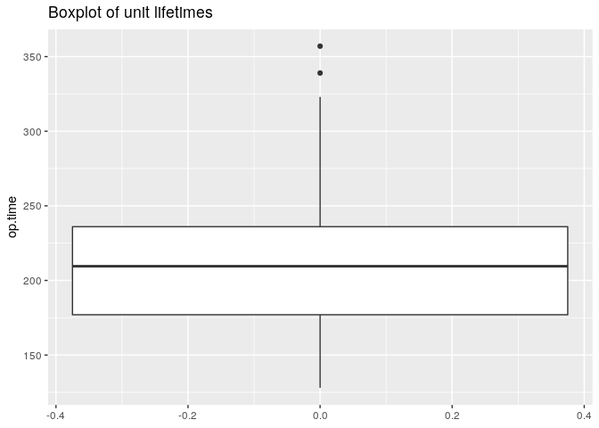

Assuming normal data, we have three relatively long-lived components. At
some point later on we might need to remove some units with
exceptionally long or short lifetimes, as they can affect predictions.

Moving on, we need to append the target variable to the training set -
Remaining Useful Lifetime (RUL \[cycles\]). According to the
description, each engine starts with different degrees of initial wear
and manufacturing variation which is unknown, and the degradation grows
in magnitude until a predefined threshold is reached, beyond which it is
not preferable to operate the engine (i.e. RUL = 0). It will make it
easier to consider the failure cycle (the cycle at which failure occurs)
to be point 0, and just use negative values for the cycles prior to
failure. Let’s call this time-to-failure:

``` r
ttf <- train %>%
  group_by(unit_no) %>%
  arrange(., t, .by_group = T) %>%
  mutate(ttf = -(rev(t) - 1)) %>%
  select(unit_no, ttf)

train$ttf <- ttf$ttf
```

Sensor data
-----------

Let’s have a closer look at the sensor recordings:

``` r
# Isolate the sensor columns
sensor.cols <- colnames(train)[grepl('s\\d', colnames(train))]

# Generate a plot list
plotlist <- lapply(sensor.cols, 
                   function(col){ 
                     train %>%
                       select(col, ttf) %>%
                       ggplot(aes(x = ttf, y = train[, col])) + 
                       geom_point(alpha = 0.01) + ylab(col)
})
  
n <- length(plotlist)
nCol <- floor(sqrt(n))
do.call("grid.arrange", c(plotlist, ncol = nCol))
```

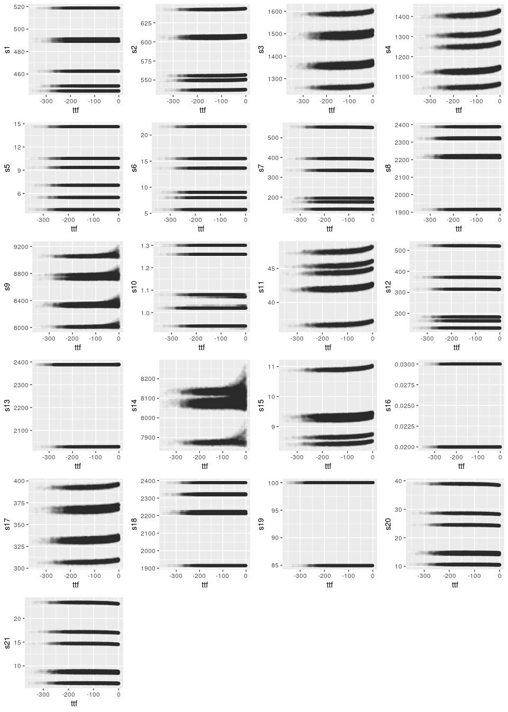

There seem to be specific clusters of values for all the sensors, which
could be related to RUL. We will test this hypothesis later on. Also,
there are several sensors which seem to be correlated. For example, s11,
s15 with s17 present the same patterns. This is normal in thermal or
mechanical systems, as it could be the case that these sensors measure,
for example, pressure and temperature at the same point of the process
(i.e., after the compressor). It is expected that such values are
correlated. For now, let’s have a quick check on the unique values:

``` r
train %>%
  select(starts_with('s')) %>%
  sapply(., function(x) length(unique(x)))
```

    ##    s1    s2    s3    s4    s5    s6    s7    s8    s9   s10   s11   s12   s13 
    ##     6  1571 11839 14713     6    14  2004   880 20945     8   671  1633   507 
    ##   s14   s15   s16   s17   s18   s19   s20   s21 
    ## 14250  8210     2    49     6     2   500 16970

Indeed some sensors only have a small number of unique values. We should
check what these values are. My guess is that if we see binary or
ordinal values, then the sensor must be reporting some kind of on/off
switch or a set of encoded integers to indicate operational state
(auto/manual/alarm etc.). If it is so, we should treat these sensors as
factors.

``` r
for (col in c('s1', 's5', 's16', 's10', 's16', 's18', 's19'))
{
  print(col)
  print(unique(train[, col]))
}
```

    ## [1] "s1"
    ## [1] 489.05 518.67 449.44 491.19 445.00 462.54
    ## [1] "s5"
    ## [1] 10.52 14.62  5.48  9.35  3.91  7.05
    ## [1] "s16"
    ## [1] 0.03 0.02
    ## [1] "s10"
    ## [1] 1.26 1.30 1.02 1.08 0.94 1.07 1.03 0.93
    ## [1] "s16"
    ## [1] 0.03 0.02
    ## [1] "s18"
    ## [1] 2319 2388 2223 2324 2212 1915
    ## [1] "s19"
    ## [1] 100.00  84.93

These don’t look like the switches I imagined. Judging from the values,
these might be environmental and engine properties. For example, the
ratio of specific heats for air at different temperatures, or something
like that. Sensor 18 could be enthalpy or something of that sort… Bottom
line, let’s skip the factor assumption (for now).

Alright, let’s have a look at monotonic relations (Spearman coeffs.)
between the sensors:

``` r
corr.mtrx <- cor(train[, sensor.cols], method = 'spearman')

corrplot(corr.mtrx, method = 'pie', type = 'lower', diag = F)
```

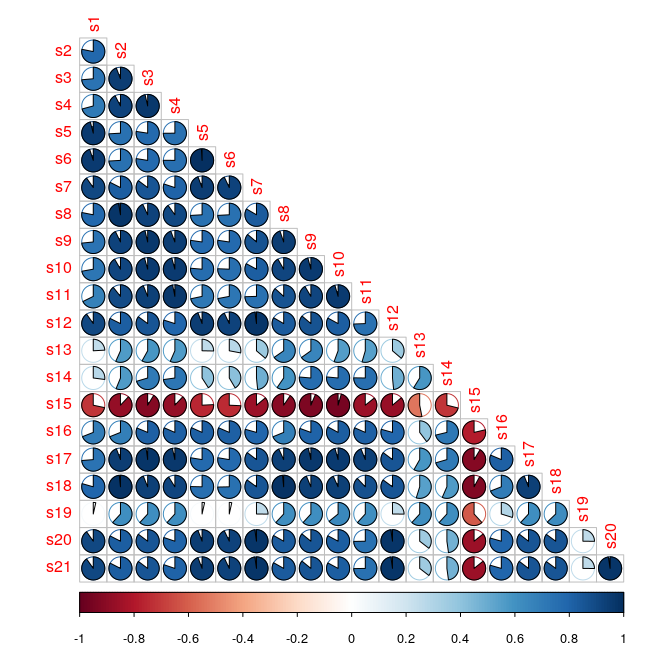

There is quite some redundancy in the dataset. We should attempt
variable selection or dimensionality reduction later on.

Before we go deeper on the analysis of the sensors, let’s instead focus
our attention on the operating conditions. The description says that
they affect the engine operation severely. Maybe if we - somehow -
account for these effects, more patterns will start emerging.

Operating Conditions
--------------------

Let’s start with a simple time-series plot for every setting.

``` r
train %>% 
  select(t, op1, op2, op3) %>%
  melt(id = "t") %>%
  ggplot(., aes(x = t, y = value)) +
  geom_point(alpha = 0.0125) +
  facet_wrap(~ variable, scales = "free") +
  ggtitle('Operating condition settings')
```

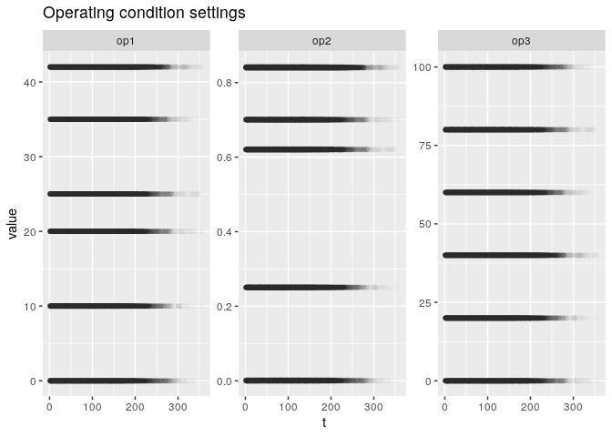

This is interesting. There seem to be distinct operating conditions for
all settings. Let’s have a look at unique values:

``` r
#op1
for (setting in c('op1', 'op2', 'op3'))
{
  print(paste('Unique values for', setting, ':', length(unique(train[, setting]))))
}
```

    ## [1] "Unique values for op1 : 536"
    ## [1] "Unique values for op2 : 105"
    ## [1] "Unique values for op3 : 6"

``` r
print(paste('Unique combinations :', dim(unique(train[, c('op1', 'op2', 'op3')]))[1]))
```

    ## [1] "Unique combinations : 8915"

The number of unique values show a different picture. Looking at the
graphs above, each operational setting must be clustered around the
small number of points shown in the graph, with a very small variance
around them. We could round them up to the most frequent values, and
reduce the overall number of operating conditions. Let’s plot all of
them together:

``` r
scatter3D(x = train$op1,
          y = train$op2,
          z = train$op3,
          bty = "b2", colkey = F,
          pch = 19, cex = 1,
          theta = 40, phi = 0,
          main = '3D Scatterplot of operating conditions',
          xlab = "op.setting 1",
          ylab ="op.setting 2", 
          zlab = "op.setting 3")
```

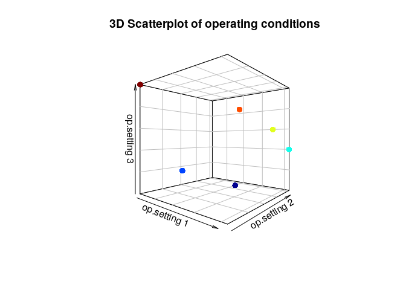

This is convenient. The operating conditions are clustered around 6
distinct operating profiles. k-Means should easily identify the clusters
without even scaling the data:

``` r
set.seed(1)
op_clusters <- kmeans(train[, c('op1', 'op2', 'op3')], centers = 6, nstart = 48)

op_clusters$centers
```

    ##            op1          op2 op3
    ## 1 35.003053346 0.8404892842  60
    ## 2 42.003043989 0.8405104226  40
    ## 3 25.003012614 0.6205164075  80
    ## 4  0.001516753 0.0004976704 100
    ## 5 10.002962685 0.2505025283  20
    ## 6 20.002946478 0.7004971644   0

Here are our cluster centers. Let’s append the cluster number to the
training dataset, and use that to further explore the data.

``` r
# Append cluster no. to the training set
train$op_cluster <- factor(op_clusters$cluster)
```

This is potentially the most useful information we have extracted from
the data so far. By significantly reducing the number of operating
conditions into a manageable size, we have the ability to completely
remove their effects from the sesnsor measurements.

Effect of operating conditions on sensor behavior
-------------------------------------------------

Now, let’s see how the sensor values differ under different operating
conditions, by making the initial plot highlighting each operating
cluster with a different color:

``` r
# Generate a plot list
plotlist <- lapply(sensor.cols, 
                   function(col){ 
                     train %>%
                       select(col, ttf, op_cluster) %>%
                       group_by(op_cluster) %>%
                       ggplot(aes(x = ttf, y = train[, col], color = op_cluster)) + 
                       geom_point(alpha = 0.0075) + ylab(col) + 
                       theme(legend.position = 'none')
})
  
n <- length(plotlist)
nCol <- floor(sqrt(n))
do.call("grid.arrange", c(plotlist, ncol = nCol))
```

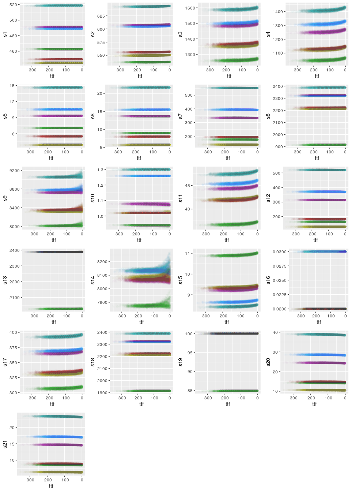

This is really convenient. We can see that for most of the sensors the
differences occur due to the operating conditions. Finding the clusters
as we did earlier has indeed simplified things a lot. To remove the
effect of the operating conditions, we can standardize the data per
cluster. This will remove the highly volatile changes caused by
transitioning from condition to condition. Let’s begin:

``` r
# Calculate summary statistics of each sensor per cluster
get_summary_stats <- function(dset)
{
  sensor.cols <- colnames(dset)[grepl("s\\d", colnames(dset))]
  
  sum.stats <- dset %>%
    select(sensor.cols, op_cluster) %>%
    group_by(op_cluster) %>%
    summarize_all(funs(mean, sd))
  return (sum.stats)
}

# Function to standardize the sensors
standardize_sensors <- function(dset, summary_stats)
{
  sensor.cols <- colnames(dset)[grepl("s\\d", colnames(dset))]
  std.sensors <- left_join(dset, summary_stats, by = 'op_cluster')
  std.sensors <- (std.sensors[, sensor.cols] - std.sensors[, paste0(sensor.cols,"_mean")]) / std.sensors[, paste0(sensor.cols,"_sd")]
  return(std.sensors)
}

train.sum.stats <- get_summary_stats(train)
std.sensors <- standardize_sensors(train, train.sum.stats)
```

Removing the effect of operating conditions
-------------------------------------------

Note that we should use the *same* summary statistics (the ones
calculated on the training set) to standardize the data per operating
cluster on the test set, and not calculate them directly on the test
set. Assume that a perfect linear predictor (sensor) exists for the
training set, with a zero value when RUL = 100%, and a value of 100 when
RUL = 0. Its mean value is 50. If we standardize directly on a
test set (and not use the summary statistics calculated on the training
set above), which contains recorded data from engines with RULs varying
from 0 to 50% - half their lifetime has already passed - we will
standardize it with a mean value of 25, rendering it essentially useless
for prediction purposes.

Let’s see how our standardized sensor data looks:

``` r
std.sensors %>%
  mutate(ttf = train$ttf) %>%
  melt(id.vars = 'ttf') %>%
  ggplot(aes(x = ttf, y = value)) + 
  geom_point(alpha = 0.0075) + 
  geom_smooth(formula = y ~ s(x, bs = "cs"), 
              method = 'gam') + 
  facet_wrap(~variable, scales = 'free') + 
  ggtitle('Standardized sensor measurements')
```

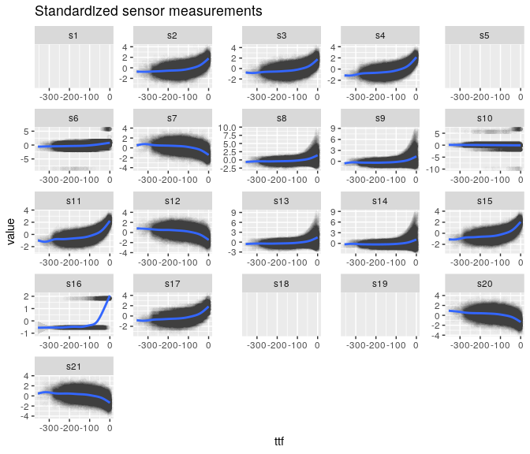

Indeed, some patterns have already started to emerge. Note that the
blank graphs correspond to sensors which present zero variation within
operating clusters. When the cluster mean value is subtracted from these
sensors, the resulting recorded value is constantly zero, i.e. no
predictive power for our purposes. Furthermore, there are a few sensors
which present zero variability within *some* operating clusters, for
which the resulting values from the above code snippet are NaNs, due to
the fact we divide by a zero-valued standard deviation.

A closer look on the sensor values
----------------------------------

Let’s have a look at how much missing data we get from this:

``` r
missing.data <- sapply(std.sensors, function(x) sum(is.na(x)) / length(x))

missing.data[which(missing.data > 0)]
```

    ##        s1        s5       s10       s16       s18       s19 
    ## 1.0000000 1.0000000 0.3013197 0.8525415 1.0000000 1.0000000

We have zero within-operating-cluster-variability for sensors 1, 5, 18,
19. Sensor 16 presents zero variability for (I would guess) 4 clusters,
and sensor 10 for around two clusters. Looking at the above graph,
sensors 10 and 16 do not seem to have a pattern even when they do show
some variability. I think we can safely drop them altogether.

Let’s update the training set and check at a violin plot:

``` r
# Append the standardized sensors
train[, sensor.cols] <- std.sensors

sensor.cols.to_drop <- c('s1', 's5', 's10', 's16', 's18', 's19')

# Remove spares
train[, sensor.cols.to_drop] <- NULL

# Make a list with the usable sensors, for later on
usable_sensor.cols <- sensor.cols[!(sensor.cols %in% sensor.cols.to_drop)]


# Append the standardized sensors
train %>%
  select(usable_sensor.cols) %>%
  melt() %>%
  ggplot(aes(y = value)) +
  geom_violin(aes(x = variable))+
  ggtitle('Violin plot of most sensor measurements')
```

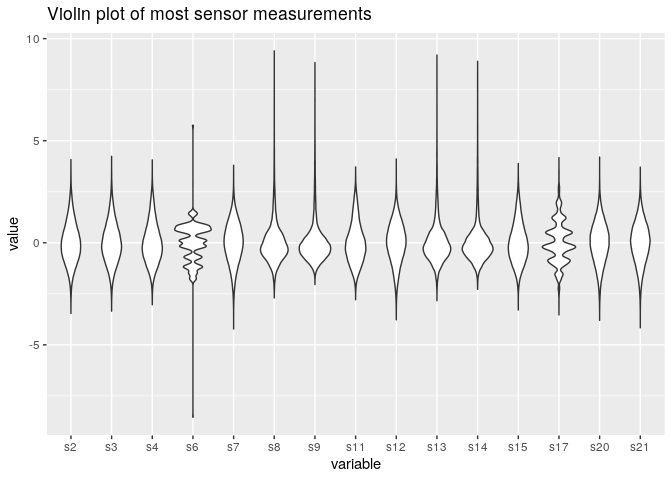

Normal looking data, apart from sensors 6 and 17. Also sensors 8, 9, 13,
14 seem to have outliers. Let’s take a closer look:

``` r
train %>%
  select(ttf, s6, s8, s9, s13, s14, s17) %>%
  melt(id.vars = 'ttf') %>%
  ggplot(aes(x = ttf, y = value)) + 
    geom_point(alpha = 0.02) +
    facet_wrap(~variable, scales = 'free') +
    ggtitle('Closer look at specific sensors')
```

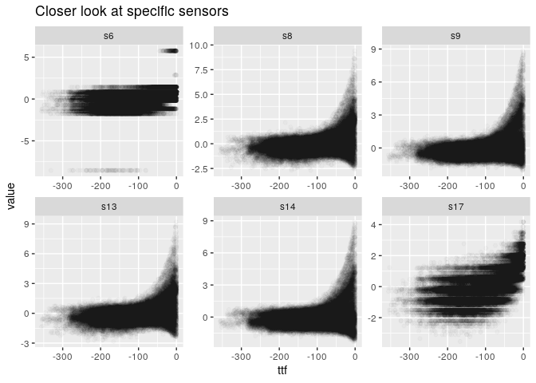

Indeed, the scatterplots explain the irregularities for sensors 6 and
17, and the (mis)identifiacation of outliers. The general trend for
sensors 8, 9, 13, 14 seems to be legitimate. Sensors 6 and 17 seem to
act as discrete variables. Let’s check the number of unique values:

``` r
# Append the standardized sensors
for (sensor in c('s6', 's17'))
{
  no_unique_vals <- length(unique(train[, sensor]))
  print(paste('Unique values', sensor, ':', no_unique_vals))
}
```

    ## [1] "Unique values s6 : 14"
    ## [1] "Unique values s17 : 64"

Indeed, they have a very small number of unique values compared to the
entire dataset (45k observations). By looking at the recorded values for
sensor 6, it might not be a bad idea to drop it altogether. Before we
decide on any treatment for these sensors, let’s have a look at
monotonic relations:

``` r
# Plot a correlation matrix
corr.mtrx <- cor(train[, usable_sensor.cols], method = 'spearman')

corrplot(corr.mtrx, method = 'number', type = 'lower', diag = F)
```

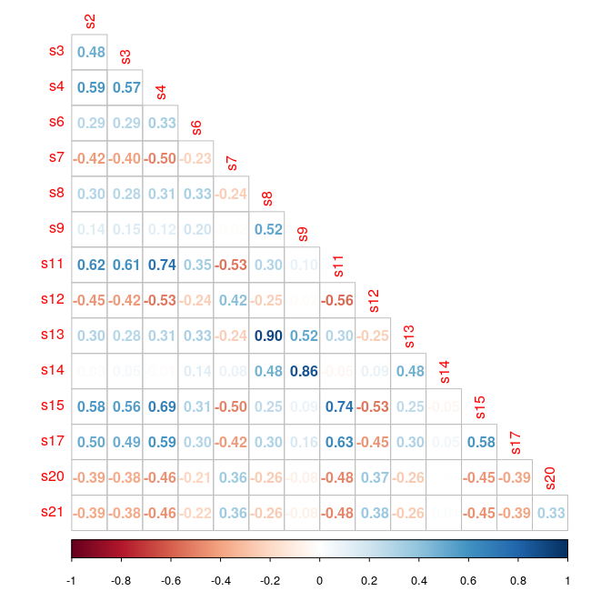

Alright, there are several sensor readings that are correlated with each other.
We need some form of dimensionality reduction.

Independent Component Analysis
------------------------------

At this point, a bit of intuition is going to help. We have sensor data
from a component. The values recorded from the sensors are an
interaction of:

-   Operating Conditions
-   Degradation
-   Sensor noise

If we assume that the interaction between these signals result in their
superposition (linear addition), we are confronted by a linear mixture
problem. This is something that ICA can, in principle, solve (its goal
is to solve Blind Source Separation problems that arise from a linear
mixture). Think about this in terms of the cocktail party problem (which
is the prototypical problem addressed in PCA). Two sounds
*s*<sub>1</sub>, *s*<sub>2</sub> are generated by music and a voice,
recorded simultaneousy in multiple microphones. Since sound adds
linearly, each microphone reconds a unique linear summation of the two
sounds. The linear weights for each microphone reflect the proximity of
each speaker to the respective microphones. The goal then is to recover
the original sources (music and voice), solely using the microphone
recordings.

In our case, the microphones correspond to the sensors, and the original
sources are the ones mentioned above. Now, we have already removed the
effect of operating conditions. This leaves two sources: degradation,
and sensor noise. If we also assume that the effect of sensor noise is
relatively small compared to the effect of degradation (hopefully this
is the case), we’re only left with one source: degradation. This implies
that we have a single basis vector, therefore only *one* independent
component. In this case, ICA boils down to *whitening* the dataset
(decorrelate it through PCA and normalize to unit variance). Let’s apply
this and see what happens:

``` r
set.seed(1)
ica <- fastICA(train[, usable_sensor.cols], n.comp = 1)

as.data.frame(ica$S) %>% # Grab the source matrix
  mutate(ttf = train$ttf) %>%
  ggplot(aes(x = ttf, y = V1)) + 
    geom_point(alpha = 0.05) +
    ylim(-6, 3) +
    ggtitle("Independent Component Analysis - IC 1")
```

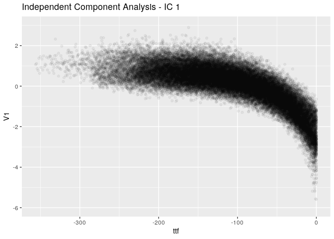

Interestingly enough, this looks like part of the P-F curve. This is a
positive indication that our assumptions do make sense after all.

Modeling approaches
-------------------

An interesting approach would be to map the sensor recordings into one
health index, following the general trend shown above, but
dimensionless. Such a health index would have a value of one when the
component is brand new, and it would gradually move towards zero near
the end. On the test set, this health index would have to be combined
with a time-series predictor (possibly an LSTM or GRU network), to give
an estimation on how many cycles ahead will it hit the zero point. Let’s
see how the above plot looks per unit, when smoothened out (loess
regression) and normalized between zero and one:

``` r
train %>%
  select(ttf, unit_no) %>%
  mutate(IC = as.numeric(ica$S)) %>%
  group_by(unit_no) %>%
  do(loess_IC = predict(loess(IC ~ ttf, span = 0.4, data = .), 
                   data = (.))) %>%
  tidyr::unnest() %>%
  ungroup() %>%
  mutate(ttf = train$ttf) %>%
  mutate(unit_no = train$unit_no) %>%
  group_by(unit_no) %>%
  mutate(norm_loess_IC = (loess_IC - min(loess_IC)) / (max(loess_IC) - min(loess_IC))) %>%
  ungroup() %>%
  ggplot(aes(x = ttf, y = norm_loess_IC, color = unit_no)) + 
    geom_smooth(method = "loess", se = F) + 
    ggtitle('Dimensionless Health Index per unit') + 
    theme(legend.position = "none")
```

    ## Warning: `cols` is now required when using unnest().
    ## Please use `cols = c(loess_IC)`

    ## `geom_smooth()` using formula 'y ~ x'

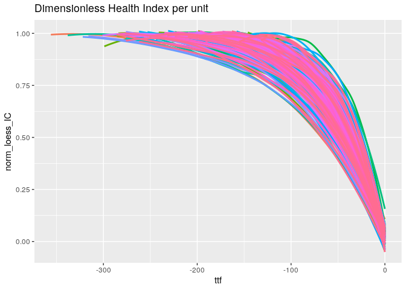

Indeed, we could use a model to map the sensor readings to the curves
shown above, and then use another model to forecast on them.

A different approach would be to track similarities, based on the
independent component (the dimensionless health index cannot be
determined directly on the test set). Let’s apply a log transform on the
IC, to linearize the model:

``` r
IC.min <- abs(min(as.numeric(ica$S))) # For log transforms

as.data.frame(ica$S + IC.min) %>% # Grab the source matrix
  mutate(ttf = train$ttf) %>%
  ggplot(aes(x = ttf, y = log1p(V1))) + 
    geom_point(alpha = 0.1) +  
    ylim(-6, 3) +
    ggtitle("IC 1 - log transform")
```

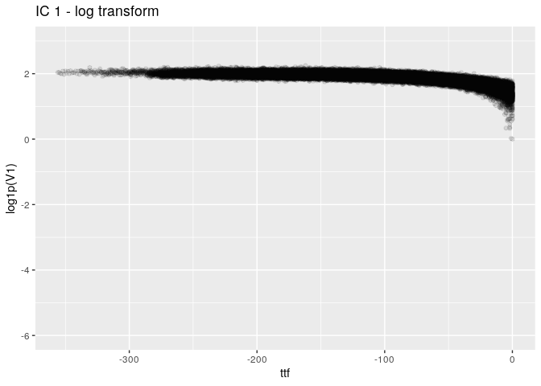

Now, the points have much less spread, and we’ve almost linearized the
independent component. Let’s try to summarize the above plot
(log-transformed IC) per unit:

``` r
train %>%
  select(ttf, unit_no) %>%
  mutate(IC = ica$S + IC.min) %>%
  group_by(unit_no) %>%
  ggplot(., aes(x = unit_no, y = log1p(IC), color = unit_no)) +
    geom_boxplot(notch = T, outlier.shape = NA) +
    ylim(1.4, 2.25) +
    ggtitle("log1p(IC) - Boxplots per unit") + 
    theme(legend.position = 'none', axis.text.x = element_blank())
```

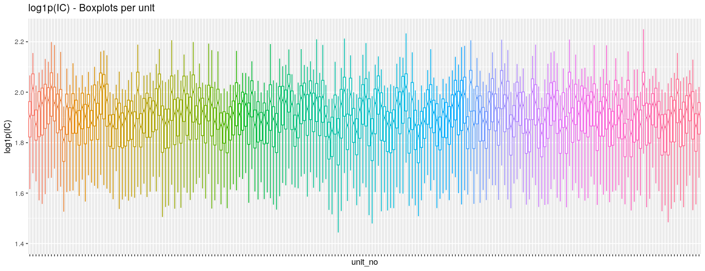

Not the most succesful visualization, but we can still see that there is
considerable deviation among different units. Regarding the test set, we
could determine the IC, compare its trajectory with all trajectories of
the train set, and use a weighted average approach to estimate when it
will reach the end of its life.

To do such a comparison we need an appropriate distance metric. Given
that we want to compare time-series with different lengths (no. of
points), the most common method is Dynamic Time Warping. However, given
the curves above, the shifting capabilities of DTW may be more of a
hindrance rather than help. An easy way to go about this would be to fit
a regression line on each log-transformed IC trajectory in the training
and test sets, and compare Euclidean distances among these coefficients.
Let’s extract them for every trajectory (unit) in the training set, and
visualize them:

``` r
lr.coeffs.train <- train %>%
  select(t, unit_no) %>%
  mutate(IC = log1p(as.numeric(ica$S) + IC.min)) %>%
  group_by(unit_no) %>%
  do(fit_IC = lm(IC ~ t, data = .)) %>%
  mutate(tidys = list(broom::tidy(fit_IC))) %>%
  tidyr::unnest(tidys) %>%
  select(unit_no, term, estimate) %>%
  mutate(intercept = ifelse(term == '(Intercept)', estimate, NA)) %>%
  mutate(t = ifelse(term == 't', estimate, NA)) %>%
  mutate(intercept = lag(intercept)) %>%
  select(-term, -estimate) %>%
  na.omit()

op.time <- train %>%
  group_by(unit_no) %>%
  mutate(op.time = max(t)) %>%
  ungroup() %>%
  distinct(unit_no, op.time) %>%
  select(op.time) 

lr.coeffs.train$op_time <- op.time$op.time

ggplot(lr.coeffs.train, aes(x = intercept, y = t, label = unit_no, color = op_time)) + 
  geom_point() + 
  geom_text(size = 2.5, check_overlap = T, nudge_y = 1e-4) +
  ggtitle('log1p(IC) ~ t: Regression coeffs and total operating time') + 
  scale_color_gradient(low="blue", high="red")
```

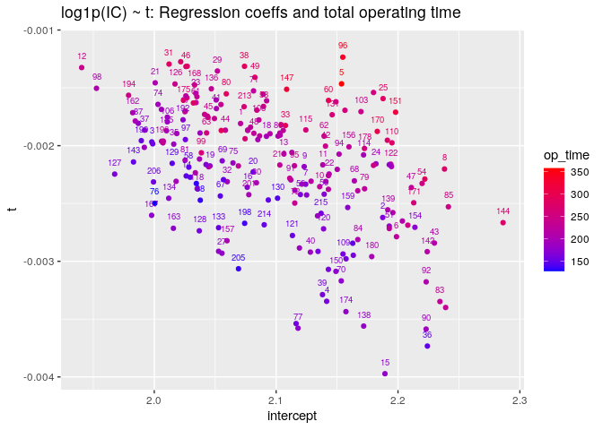

Let’s see if the method is valid. We can see (near the top right corner)
that units 25 and 151 are relatively close together, but far away from
217 (right corner). Let’s plot their trajectories:

``` r
train %>%
  select(t, unit_no) %>%
  mutate(IC = as.numeric(ica$S)) %>%
  filter(unit_no == 25 | unit_no == 151 | unit_no == 127) %>%
  ggplot(aes(x = t, y = IC, color = unit_no)) + 
      geom_line() + 
      ggtitle("IC trajectory proximity between units 25, 151 and 127")
```

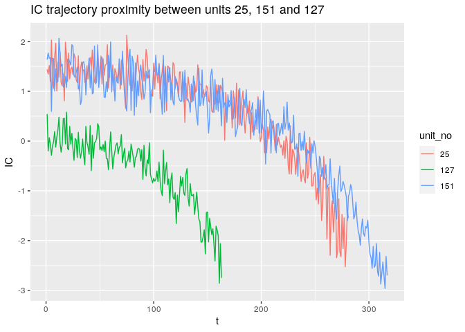

Indeed, the method works. Units 12 and 98 present similar trajectories,
in contrast to unit 15. This means, that a possible approach would be to
apply k-Nearest Neighbor regression on the linear model’s coefficients
directly.

Predictive modeling
===================

Let’s summarize the approach that we will follow. For each unit in the
test set:

-   Cluster the operating conditions into 6 distinct clusters, as
    identified in the training set.
-   Drop the unnecessary sensors: 1, 5, 10, 16, 18, 19.
-   Standardize the sensor values within each operating cluster.
-   Calculate the independent component, as identified by ICA.
-   Perform regression with the natural logarithm of the independent
    component as the dependent variable and time as the independent
    variable.
-   Extract the coefficients of the regression model, and standardize
    them.

Then we’ll try different algorithms and see from there on…

Preprocessing steps
-------------------

Now, let’s make a few wrappers for the above steps, starting with a
function to split the dataset:

``` r
# Function to split the dataset into a train and a validation subset
split_dataset <- function(dset, ratio)
{
  # Get the total number of units present in the dataset
  total_units <- max(as.numeric(dset$unit_no))
  
  # Randomly select a number of units
  val_units <- sample(1:total_units, size = round(total_units * ratio))
  
  # Get the indices from the dataset that belong to these units
  val_indices <- which(dset$unit_no %in% val_units)
  
  # Split into new datasets
  val <- dset[val_indices, ]
  train <- dset[-val_indices, ]
  
  return(list(train, val))
}
```

Clustering the operating conditions:

``` r
# Function to return the operating cluster
get_cluster <- function(dset, centers)
{
  # Isolate the operating settings
  clusters <- dset %>%
  select(op1, op2, op3) 

  # Calculate Euclidean distance between each operating setting and all cluster centers
  clusters <- as.data.frame(t(apply(clusters, 1, 
                                    function(y) apply(centers, 1, 
                                                      function(x) sum(sqrt((y - x) ^2)) )))) %>%
    mutate(op_cluster = apply(., 1, function(x){names(x)[which.min(x)]})) %>%
    mutate(op_cluster = as.numeric(op_cluster)) %>% # Convert from list
    select(op_cluster)
  
  # Return
  return(clusters)
}
```

The functions to calculate summary statistics on the train set and to
standardize the sensors within each cluster were developed earlier,
there’s no need to do it again.

Next, get the principal component of ICA (which is just a matrix
multiplication with the whitening matrix):

``` r
# Function to apply whitening
get_IC <- function(input_df, ica_obj)
{
  # Multiply each row of the dataset with the whitening matrix.
  ic <- as.matrix(input_df) %*% ica_obj$K
  # Return it
  return(ic)
}
```

Apply linear regression and extract the coefficients:

``` r
# Function to get the regression coefficients
get_coeffs <- function(dset, ica_obj)
{
  IC.min <- min(as.numeric(ica_obj$S)) # For the log transform
  
  lr.coeffs <- dset %>%
    select(t, unit_no, IC) %>%
    filter(IC > IC.min) %>%
    mutate(IC = log1p(as.numeric(IC) + abs(IC.min))) %>% 
    group_by(unit_no) %>%
    do(fit_IC = lm(IC ~ t, data = .)) %>%
    mutate(tidys = list(broom::tidy(fit_IC))) %>%
    tidyr::unnest(tidys) %>%
    select(unit_no, term, estimate) %>%
    mutate(intercept = ifelse(term == '(Intercept)', estimate, NA)) %>%
    mutate(t = ifelse(term == 't', estimate, NA)) %>%
    mutate(intercept = lag(intercept)) %>%
    select(-term, -estimate) %>%
    na.omit() %>%
    ungroup()
  
  return(lr.coeffs)
}
```

Note that the coefficients should be standardized, depending on the
approach we’ll follow, as the absolute values of the intercepts might
dominate the time coefficients in distance-based algorithms:

``` r
# Function to standardize the coefficients of the LR model
std_coeffs <- function(input.coeffs, train.coeffs)
{
  # Get summary stats
  mean.t <- mean(train.coeffs$t)
  sd.t <- sd(train.coeffs$t)
  mean.int <- mean(train.coeffs$intercept)
  sd.int <- sd(train.coeffs$intercept)
  
  # Normalize them
  input.coeffs <- input.coeffs %>%
    mutate(t = (t - mean.t) / sd.t) %>%
    mutate(intercept = (intercept - mean.int) / sd.int)
  
  return(input.coeffs)
}
```

Also, a function to calculate the error metric is needed:

``` r
# Function to calculate the error metric
get_metric <- function(model.predictions, true.values)  
{
  d <- model.predictions - true.values
  d <- ifelse(d <= 0, exp(-d / 13) - 1, exp(d / 10) - 1)
  return(mean(d))
}
```

We also need a few more helper functions, to remove some data from the
validation set for us to forecast, and a few more functions to abstract
away some manual work through the process:

``` r
# Function to cut down the validation data below a certain time threshold
cut_dset <- function(dset, cutoff)
{
  partial <- dset %>%
    group_by(unit_no) %>%
    filter(t < max(t) * cutoff) %>%
    ungroup()
  
  return(partial)
}

# Function to return the total operating time for each unit in a dataset
get_total_time <- function(dset)
{
  dset.new <- dset %>%
  group_by(unit_no) %>%
  mutate(op.time = max(t)) %>%
  ungroup() %>%
  distinct(unit_no, op.time) %>%
  select(unit_no, op.time) %>%
  mutate(op.time = as.numeric(op.time))
  
  return(dset.new)
}

# Function to determine the mode of a given set of data
get_mode <- function(x) {
  # Estimate the probability mass function distribution, given the data
  dx <- density(x, na.rm = T)
  # Get the value that maximizes the probability mass function
  mode <- dx$x[which.max(dx$y)]
  return(mode) 
} 
```

Next, let’s wrap some of the wrappers themselves in a function to
preprocess the train and validation sets, up to the point the steps are
common for both approaches, and a function to return the datasets
(training, validation) for each fold:

``` r
# Function to preprocess the training set
preprocess_original_dset <- function(dset)
{
  
  # Train a k-means algorithm to estimate the operating clusters
  op_clusters <- kmeans(dset[, c('op1', 'op2', 'op3')], 
                        centers = 6, 
                        nstart = 48)
  
  # Append the clusters on the set
  dset[, 'op_cluster'] <- op_clusters$cluster
    
  # Drop redundant sensors
  dset[, c('s1', 's5', 's10', 's16', 's18', 's19')] <- NULL
  
  # Calculate summary statistics for each sensor per cluster on the training set
  dset.sum.stats <- get_summary_stats(dset)
  
  # Standardize the sensors
  usable_sensor.cols <- colnames(dset)[grepl('s\\d', colnames(dset))]
  dset[, usable_sensor.cols] <- standardize_sensors(dset, dset.sum.stats)
  
  # Apply ICA on the data set
  ica <- fastICA(dset[, usable_sensor.cols], n.comp = 1)
  
  # Get the independent component
  dset$IC <- as.numeric(get_IC(dset[, usable_sensor.cols], ica))
  
  # Extract the linear regression coefficients
  lr.coeffs <- get_coeffs(dset, ica) 
  
  # Return list with outputs
  out <- list("train_summary_statistics" = dset.sum.stats,
              "op_settings_clustering" = op_clusters,
              "ICA_object" = ica,
              "LR_coeffs" = lr.coeffs)
  
  return(out)
}

# Function to preprocess the validation set (up to the point which is common for the two models)
preprocess_synthetic <- function(dset, params, for_test_set)
{
  if (for_test_set == F)
  {
    # Get total operating time
    y <- dset %>%
      distinct(unit_no, op.time) %>%
      select(op.time)
  }
  
  # Get operating cluster
  clusters <- get_cluster(dset, params$op_settings_clustering$centers)
  dset <- cbind(dset, clusters)
    
  # Drop redundant sensors
  dset[, c('s1', 's5', 's10', 's16', 's18', 's19')] <- NULL
  
  # Standardize the sensors
  usable_sensor.cols <- colnames(dset)[grepl('s\\d', colnames(dset))]
  dset[, usable_sensor.cols] <- standardize_sensors(dset, params$train_summary_statistics)
  
  # Get the independent component
  dset$IC <- as.numeric(get_IC(dset[, usable_sensor.cols], params$ICA_object))
  
  # Get the linear coefficients from the ICA object
  lr.coeffs <- get_coeffs(dset, params$ICA_object) 
  
  # Generate the new dataset
  if (for_test_set == F)
  {
    new_dset <- as.data.frame(std_coeffs(lr.coeffs, params$LR_coeffs)) %>%
      mutate(target = y$op.time) %>%
      select(-unit_no)
  } else {
    new_dset <- as.data.frame(std_coeffs(lr.coeffs, params$LR_coeffs)) %>%
      select(-unit_no)
  }
  
  return(new_dset)
}
```

Alright, we can start building our models now. One key idea is to make
the training/validation sets resemble the test set. Note that the test
set contains truncated data, i.e. components whose sensor trajectories
do not reach the end of their lifetime, in contrast to the training set
we’ve been observing so far. Therefore, if we truncate the training set
at random moments through a unit’s lifetime, well be able to make a
dataset more similar to the one that our models will be evaluated on.
This randomness gives us the ability to perform the truncation process
multiple times for each unit (with the same operating time of course),
therefore generating a multitude of datasets! Let’s do this:

``` r
# Reproducibility
set.seed(1)

val_ratio <- 0.3 # 30% of the data will go to the validation set

# Clean read
data <- data.frame(read_data('train.txt')) 

# Split into three datasets
data <- split_dataset(data, val_ratio) # Remove the holdout set
train <- data[[1]]
val <- data[[2]]

# Get the objects needed for preprocessing the new datasets
preprocess_objects <- train %>% preprocess_original_dset

# Truncation limits and number of datasets to generate
no.datasets <- 80
min.lifetime <- 0.2
max.lifetime <- 0.9

# Generate the new datasets
new.train <- lapply(seq_len(no.datasets), function(x){
                                  train %>% 
                                  group_by(unit_no) %>%
                                  mutate(op.time = max(t)) %>%
                                  filter(t <= round(max(t) * sample(seq(min.lifetime, 
                                                                        max.lifetime,
                                                                        by = 0.05), 
                                                                    size = 1))) %>%
                                  ungroup %>% 
                                  do(preprocess_synthetic(., preprocess_objects, F))}) %>%
  do.call("rbind", .)
```

Now we have our processed datasets. We will generate a set of trained
models on the data using caretEnsemble. The models to be generated are
the following:

-   Linear regression
-   Regression tree
-   Support vector regressor with radial kernel
-   Rule-based model, using Cubist
-   Random forest
-   Stochastic gradient boosting regressor

Let’s create the instances and train them using Caret. We’ll perform
repeated cross validation (10 folds, 20 repetitions), using the
competition’s metric as the objective function to minimize:

``` r
# Reproducibility
set.seed(1)
  
# Re-write this to the proper format for Caret
eval_metric <- function(data, lev = NULL, model = NULL) { # Compute the competition metric
                        y_hat = data$pred
                        y = data$obs
                        d <- y_hat - y
                        d <- ifelse(d <= 0, exp(-d / 13) - 1, exp(d / 10) - 1)
                        score_val <- mean(d)
                        c(S = score_val)
                        }

# Generate the models
model_list <- caretList(
  target ~ ., 
  data = new.train,
  metric = "S",
  maximize = F, 
  trControl = trainControl(
    method = "repeatedcv", # Don't know how stable each model will be
    number = 5,
    repeats = 3,
    savePredictions = "final",
    summaryFunction = eval_metric,
    index = createResample(new.train$target, 5)
    ),
  methodList = c("lm", "rpart", "svmRadial", "cubist", "rf"),
  tuneList = list(gbm = caretModelSpec(method = "gbm", verbose = F))
  )
```

    ## note: only 1 unique complexity parameters in default grid. Truncating the grid to 1 .

``` r
# collect resamples
results <- resamples(model_list)

# Show results
bwplot(results)
```

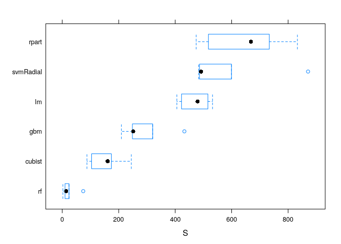

We can see that the best model is a random forest. Let’s apply our best
approach on the prediction set, and generate the submission file:

``` r
prediction_set <- data.frame(read_data('test.txt'))

running.cycles <- get_total_time(prediction_set) %>% select(op.time)

total.cycles <-  prediction_set %>%
  do(preprocess_synthetic(., preprocess_objects, T)) %>%
  predict(model_list, .) %>%
  round(.) 

total.cycles - running.cycles %>%
  mutate(op.time = ifelse(op.time < 0, 0, op.time)) %>% # In case we predict negative values
  write.table(., file = "predictions.txt", sep = "", row.names = F, col.names = F)
```

Conclusions
===========

We did get a score of 986.342, which gives us the 7th place on the test
set.
